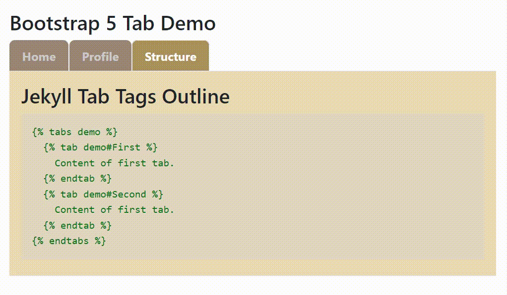

Jekyll Bootstrap 5 Tabs
[](https://badge.fury.io/rb/jekyll_bootstrap5_tabs)
===========



The original version, written by Artur Gabitov, expected Markdown and Bootstrap 4.
[This version](https://rubygems.org/gems/jekyll_bootstrap5_tabs) requires Bootstrap 5 and HTML, not Markdown.

More information is available on my web site about
[this Jekyll plugin](https://www.mslinn.com/blog/2022/02/13/jekyll-gem.html)
and [my other Jekyll plugins](https://www.mslinn.com/blog/2020/10/03/jekyll-plugins.html).


## Installation

Add this to your project's `Gemfile`:
```ruby
gem 'jekyll_bootstrap5_tabs'
```

Add this to your project's `_config.yml`:

```yaml
plugins:
  - jekyll_bootstrap5_tabs
```

And then execute:

    $ bundle install

Or install it yourself as:

    $ gem install jekyll_bootstrap5_tabs


## Usage

Bootstrap 5 is required.
One way to include Bootstrap 5 into a page within your project is to add the following HTML into the `<head/>` tag:
```html
  <link href="https://cdn.jsdelivr.net/npm/bootstrap@5.1.3/dist/css/bootstrap.min.css" rel="stylesheet"
    integrity="sha384-1BmE4kWBq78iYhFldvKuhfTAU6auU8tT94WrHftjDbrCEXSU1oBoqyl2QvZ6jIW3" crossorigin="anonymous">
```
...and add this to the bottom of the HTML file, within the `<body/>` tag:
```html
  <script src="https://cdn.jsdelivr.net/npm/bootstrap@5.1.3/dist/js/bootstrap.bundle.min.js"></script>
```

See this [working minimal Bootstrap 5 tab example](https://codepen.io/mslinn/pen/OJOjVPR)


## Two New Liquid Tags
The `jekyll_bootstrap5_tabs` plugin provides two new Liquid tags: `tabs` and `tab`.
Jekyll interprets the Liquid language when embedded into HTML pages.

For example, given the following content in a Jekyll page that has
[minimal front matter](https://jekyllrb.com/docs/front-matter/):
```
---
---

  
    Home at last!
  
  
    Profile meeee...
  
  
    Messages - I have none
  

```
The outer tabs tag has a name: `demo`.
Conceptually, this name defines a namespace scope for the inner `tab` tags, but actually this version does not use the name for any purpose.
The inner `tab` tags reference the outer `tabs` tag (yes, this is redundant),
and introduces the name of the tab that it defines after the octothorpe (aka hash mark, number sign, and pound sign: #). A Bootstrap 5 tab is created for every `tab` tag, and the `id` for each `tag` is defined by the characters following the octothorpe.
This `id` is also displayed as the label for the `tab`, so if you want it capitalized a certain way, specify the tag capitalization in the `tab` tag.

The current implementation does not allow spaces within tab labels.
Instead, tab labels may only consist of one word each.

The `jekyll_bootstrap5_tabs` plugin will generate code similar to the following.
```html
<ul class="nav nav-tabs">
  <li class="nav-item">
    <a class="nav-link active" data-bs-toggle="tab" aria-current="page" href="#home">Home</a>
  </li>
  <li class="nav-item">
    <a class="nav-link" data-bs-toggle="tab" aria-current="page" href="#profile">Profile</a>
  </li>
  <li class="nav-item">
    <a class="nav-link" data-bs-toggle="tab" aria-current="page" href="#messages">Messages</a>
  </li>
</ul>

<div class="tab-content">
  <div class="tab-pane active" id="home" aria-labelledby="home-tab">
    <editor_fold Home>
    Home at last!
    </editor_fold>
  </div>
  <div class="tab-pane" id="profile" aria-labelledby="profile-tab">
    <editor_fold Profile>
      Profile meeee...
    </editor_fold>
  </div>
  <div class="tab-pane" id="messages" aria-labelledby="messages-tab">
    <editor_fold Messages>
      Messages - I have none
    </editor_fold>
  </div>
</div>
```

### New for Version 1.1.0
By default, the plugin output is not pretty-printed.
However, you can enable pretty-printing for a single set of tabs by including the `pretty` keyword in the `tabs` tag, like this:
```

  ... tab tags go here

```

You can enable pretty-printing for the entire Jekyll site by adding the following to `_config.yaml`:
```yaml
jekyll_bootstrap5_tabs:
  - pretty: true
```


## Building

```shell
$ rake build jekyll_bootstrap5_tabs.gemspec
jekyll_bootstrap5_tabs 1.0.0 built to pkg/jekyll_bootstrap5_tabs-1.0.0.gem.
```

The most recently built gem is provided in `pkg/`.


## Installing

```shell
$ gem install pkg/jekyll_bootstrap5_tabs-1.0.0.gem
Fetching slim-4.1.0.gem
Fetching temple-0.8.2.gem
Successfully installed temple-0.8.2
Successfully installed slim-4.1.0
Successfully installed jekyll_bootstrap5_tabs-1.0.0
Parsing documentation for temple-0.8.2
Installing ri documentation for temple-0.8.2
Parsing documentation for slim-4.1.0
Installing ri documentation for slim-4.1.0
Parsing documentation for jekyll_bootstrap5_tabs-1.0.0
Installing ri documentation for jekyll_bootstrap5_tabs-1.0.0
Done installing documentation for temple, slim, jekyll_bootstrap5_tabs after 0 seconds
3 gems installed
```

Now go use the gem in a Jekyll project!

## Companion Project: Slim Explorer
I (Mike Slinn) wanted to understand more about how Artur Gabitov got the Slim language part to work.
He only provided the end result, without any hint of how he had accomplished this.
I took on the discovery of implementing a minimal development scaffold for the Slim Language.
Check out the [Slim Explorer](https://github.com/mslinn/slim_explorer)!


## Development

After checking out the repo, run `bin/setup` to install dependencies.

You can also run `bin/console` for an interactive prompt that will allow you to experiment.


### Build and Install Locally
To install this gem onto your local machine, run:
```shell
$ rake install:local
```

The following also does the same thing:
```shell
$ bundle exec rake install
```

Examine the newly built gem:
```shell
$ gem info jekyll_bootstrap5_tabs

*** LOCAL GEMS ***

jekyll_bootstrap5_tabs (1.0.0)
    Author: Mike Slinn
    Homepage:
    https://github.com/mslinn/jekyll_bootstrap5_tabs
    License: MIT
    Installed at: /home/mslinn/.gems

    Jekyll plugin that enables Bootstrap 5 tabs in Jekyll 4 websites.
```

### Build and Push to RubyGems
To release a new version,
  1. Update the version number in `version.rb`.
  2. Commit all changes to git; if you don't the next step might fail with an unexplainable error message.
  3. Run the following:
     ```shell
     $ bundle exec rake release
     ```
     The above creates a git tag for the version, commits the created tag,
     and pushes the new `.gem` file to [RubyGems.org](https://rubygems.org).


## Contributing

1. Fork the project
2. Create a descriptively named feature branch
3. Add your feature
4. Submit a pull request


## License

The gem is available as open source under the terms of the [MIT License](https://opensource.org/licenses/MIT).
